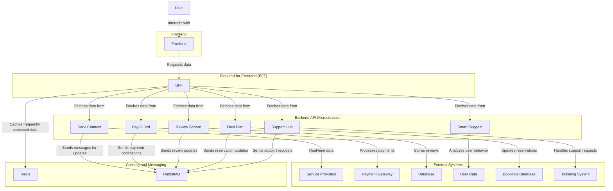

# Connectivity

The Booking Service, known as **Bookiverse**, is a sophisticated platform that connects users with various service providers through a well-structured architecture involving frontend, backend-for-frontend (BFF), and backend API microservices. This connectivity description outlines how these components interact, ensuring a seamless user experience while maintaining performance and security.

## Architecture Overview

### 1. Frontend
The frontend of the Booking Service is built using modern frameworks like React or Angular, providing a dynamic and responsive user interface. It communicates with the BFF layer to fetch data and perform actions. Key features include:

- **User Registration and Login**: Users can create accounts or log in to access personalized features.
- **Service Search**: Users input search criteria to explore available services.
- **Quick Reserve**: A streamlined booking feature that allows users to make instant reservations with minimal input.

### 2. Backend-for-Frontend (BFF)
The BFF layer acts as an intermediary between the frontend and the backend services, optimizing data retrieval and ensuring that the frontend receives only the necessary information. It handles:

- **Service Requests**: Aggregates data from various backend microservices, including **Servi Connect** for real-time service availability and pricing.
- **User Journey Management**: Tracks user interactions and preferences to enhance the overall experience.

### 3. Backend API Microservices
The backend is composed of several microservices, each responsible for specific functionalities:

#### a. Servi Connect
This microservice integrates with service providers, ensuring real-time availability and pricing. It communicates with external APIs to fetch data on accommodations, transportation, and activities.

#### b. Pay Guard
A dedicated microservice that implements security protocols to protect user payment information during transactions. It utilizes encryption and secure payment gateways to ensure safe financial interactions.

#### c. Review Sphere
This microservice manages user-generated reviews and ratings. It stores feedback in a database and calculates the **Trust Score** for service providers based on user ratings, enhancing community trust.

#### d. Smart Suggest
An AI-driven recommendation engine that analyzes user behavior and preferences to provide personalized service suggestions, improving user engagement and satisfaction.

#### e. Flexi Plan
This microservice allows users to modify their reservations easily, accommodating changes in travel plans. It interacts with the bookings database to update user reservations in real-time.

#### f. Support Hub
A centralized customer support microservice that assists users with inquiries, bookings, and issues. It provides a ticketing system and integrates with chatbots for immediate assistance.

### 4. Databases and Messaging
To enhance performance and scalability, the Booking Service employs various databases and messaging systems:

- **PostgreSQL**: Used for storing structured data such as user accounts, bookings, and service provider information.
- **Redis**: An in-memory data store that caches frequently accessed data, improving response times for service searches and user sessions.
- **RabbitMQ**: A messaging broker that facilitates communication between microservices, ensuring reliable message delivery and decoupling of services.

## Workflow Integration
The connectivity between these components supports the following workflows:

1. **User Registration and Login**: The frontend communicates with the BFF, which interacts with the user management microservice to authenticate users.
2. **Service Search**: Users input search criteria, and the BFF queries the **Servi Connect** microservice for available options, returning results to the frontend.
3. **Booking Process**: Users select a service, and the BFF coordinates with the **Pay Guard** for payment processing and the **Flexi Plan** for reservation management.
4. **Confirmation and Notifications**: Upon successful booking, the system sends confirmation emails and updates the **Review Sphere** for user feedback.
5. **Customer Support**: Users can access the **Support Hub** for assistance, which integrates with the ticketing system for efficient issue resolution.

This architecture ensures that the Booking Service operates efficiently, providing users with a seamless experience from registration to post-booking feedback while maintaining high standards of security and performance.
